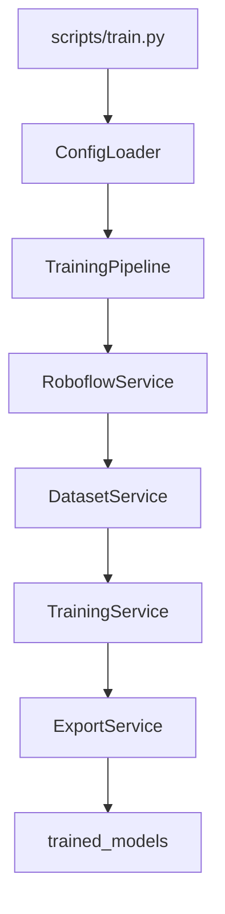

# Computer Vision Training Framework

Framework internal untuk training Object Detection berbasis Python dan Ultralytics YOLO11.

Fokus utama framework ini adalah reusability lintas proyek, arsitektur modular, dan pipeline training yang konsisten dari data ingestion hingga export model final.

## Overview

Framework ini menyediakan alur end-to-end berikut:

1. Load konfigurasi terpusat dari YAML.
2. Ambil dataset dari Roboflow jika belum tersedia lokal.
3. Validasi struktur dataset sebelum training.
4. Training dan validation model YOLO11.
5. Export model terbaik ke direktori model produksi.
6. Logging terstruktur untuk observability proses.

Framework didesain dengan prinsip berikut:

- Clean Architecture
- Single Responsibility Principle
- Dependency Injection
- Modular dan mudah diuji
- Konsisten untuk CPU dan GPU environment

## Architecture

Komponen utama framework:

- ConfigLoader
	- Memuat konfigurasi dari YAML sekali di composition root.
- RoboflowService
	- Menyiapkan dataset dari Roboflow atau dataset lokal.
- DatasetService
	- Validasi data.yaml, subset folder, jumlah kelas, dan ringkasan dataset.
- TrainingService
	- Menjalankan training dan validation menggunakan Ultralytics YOLO11.
- ExportService
	- Menyalin best.pt ke trained_models dengan penamaan aman.
- TrainingPipeline
	- Orchestrator yang mengoordinasikan seluruh flow melalui public API service.
- scripts/train.py
	- Entry point tipis tanpa business logic.

### High-Level Flow



## Folder Structure

```text
computer-vision/
├── configs/
│   └── config.yaml
├── datasets/
├── pretrained/
├── trained_models/
├── experiments/
├── services/
│   ├── dataset_service.py
│   ├── export_service.py
│   ├── roboflow_service.py
│   ├── training_pipeline.py
│   └── training_service.py
├── utils/
│   ├── config.py
│   └── logger.py
├── scripts/
│   └── train.py
├── requirements.txt
└── README.md
```

## Installation

### 1. Clone Repository

```bash
git clone <repository-url>
cd computer-vision
```

### 2. Create Virtual Environment (Recommended)

```bash
python -m venv .venv
```

Windows PowerShell:

```bash
.venv\Scripts\Activate.ps1
```

Linux or macOS:

```bash
source .venv/bin/activate
```

### 3. Install Dependencies

Pip:

```bash
pip install -r requirements.txt
```

UV (opsional):

```bash
uv pip install -r requirements.txt
```

## Requirements

- Python 3.12+
- Ultralytics
- Roboflow SDK
- PyYAML
- PyTorch

Catatan:

- GPU training membutuhkan CUDA-compatible PyTorch build.
- CPU mode tetap didukung otomatis jika GPU tidak tersedia.

## Configuration

Konfigurasi utama berada di file berikut:

- configs/config.yaml

Bagian penting konfigurasi:

- project
	- Metadata proyek dan nama eksperimen.
- roboflow
	- Workspace, project, version, dan API key untuk dataset source.
- model
	- pretrained_path untuk nama model Ultralytics atau path lokal.
- training
	- Parameter training seperti epochs, batch, imgsz, optimizer, device.
- validation
	- Parameter validasi seperti conf dan iou.
- output
	- Direktori datasets, experiments, pretrained, dan trained_models.

Contoh minimal:

```yaml
project:
	name: "YOLO11_Object_Detection"

roboflow:
	workspace: "your-workspace"
	project: "your-project"
	version: 1
	api_key: "YOUR_ROBOFLOW_API_KEY"

model:
	pretrained_path: "yolo11n.pt"

training:
	epochs: 100
	batch: 16
	imgsz: 640
	device: ""

output:
	experiments_dir: "experiments"
	trained_models_dir: "trained_models"
```

## Training Flow

Urutan proses training di pipeline:

1. ConfigLoader memuat konfigurasi.
2. RoboflowService memastikan dataset tersedia.
3. DatasetService memvalidasi dataset.
4. DatasetService menampilkan ringkasan dataset.
5. TrainingService menjalankan training dan validation.
6. TrainingService mengembalikan path best.pt.
7. ExportService menyalin model ke trained_models.
8. TrainingPipeline mencetak ringkasan akhir proses.

## Cara Menjalankan Training

Jalankan dari root project:

```bash
python scripts/train.py
```

Jika sukses, log akan menampilkan:

- status validasi dataset
- progres training
- lokasi best.pt
- lokasi model hasil export
- ringkasan durasi proses

## Output yang Dihasilkan

Setelah training selesai, output utama:

- experiments/
	- Artefak run Ultralytics (weights, metrics, plots, logs).
- trained_models/
	- Model hasil export untuk digunakan ke tahap deployment.
	- Jika nama file sudah ada, framework menambahkan timestamp untuk mencegah overwrite.

## Future Development

Rencana pengembangan berikutnya:

1. Penambahan automated testing untuk unit dan integration test.
2. Validasi skema konfigurasi yang lebih ketat (typed schema).
3. Support experiment tracking terintegrasi (misalnya MLflow atau W and B).
4. Export format tambahan (ONNX, TensorRT, OpenVINO) melalui service terpisah.
5. Dukungan multi-dataset dan curriculum training.
6. Integrasi CI pipeline untuk lint, test, dan quality gate.
